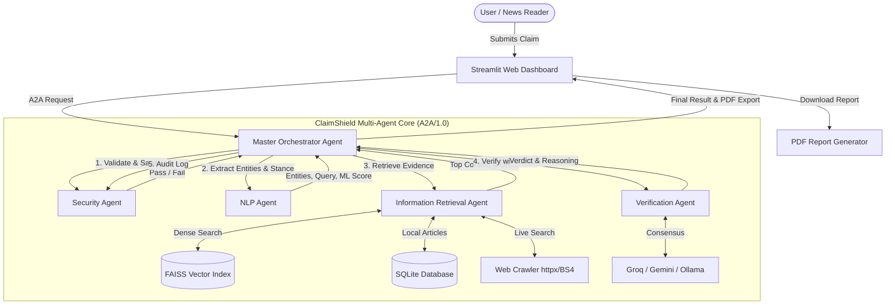

#  ClaimShield AI — Multi-Agent Fact Verification System

[](https://www.python.org/)
[](https://github.com/langchain-ai/langgraph)
[](https://github.com/microsoft/autogen)
[](https://github.com/facebookresearch/faiss)
[](https://streamlit.io/)
[](LICENSE)

> **ClaimShield AI** is an advanced, production-grade **Agentic AI** framework designed for real-time news claim verification. Powered by a collaborative network of **5 specialized agents** communicating via the **A2A/1.0 (Agent-to-Agent) JSON messaging protocol**, ClaimShield delivers transparent, evidence-backed fact checking using dense vector retrieval, NLP analysis, and multi-LLM consensus verification.

---

## 📑 Table of Contents
- [System Architecture](#-system-architecture)
- [Specialized Agents](#-specialized-agents)
- [Workflow Pipeline](#-workflow-pipeline)
- [Tech Stack](#-tech-stack)
- [Project Directory Structure](#-project-directory-structure)
- [Quick Start Guide](#-quick-start-guide)
  - [Prerequisites](#prerequisites)
  - [Installation](#installation)
  - [Environment Configuration](#environment-configuration)
  - [Database Seeding](#database-seeding)
  - [Running the Application](#running-the-application)
- [A2A/1.0 Messaging Protocol](#-a2a10-messaging-protocol)
- [Evaluation & Testing](#-evaluation--testing)
- [Team Members & Contributions](#-team-members--contributions)

---

## 🏛️ System Architecture

ClaimShield AI orchestrates verification across a multi-stage agentic pipeline:



---

##  Specialized Agents

| # | Agent | Primary Role & Responsibilities | Key Technologies |
|---|---|---|---|
| 1 | **Master Orchestrator Agent** | Controls agent lifecycle, message dispatching, state management, and fallback strategies. Supports **LangGraph StateGraph** and **AutoGen Multi-Agent Debate**. | `langgraph`, `autogen`, Python |
| 2 | **NLP Agent** | Analyzes claim syntax, extracts Named Entities (NER), generates search queries, and scores stance credibility using Machine Learning. | `spaCy (en_core_web_sm)`, `scikit-learn (TF-IDF + LogisticRegression)` |
| 3 | **Information Retrieval (IR) Agent** | Indexes and retrieves matching ground-truth evidence using dense semantic vector search and live web scraping. | `FAISS`, `SentenceTransformers (all-MiniLM-L6-v2)`, `httpx`, `BeautifulSoup4` |
| 4 | **Fact-Verification Agent** | Evaluates retrieved evidence against the claim using multi-provider LLMs to generate a verdict, confidence score, and explanation. | `Groq (Llama 3.3)`, `Google Gemini Flash`, `Ollama (Local)`, Heuristic Fallback |
| 5 | **Security & Audit Agent** | Enforces PBKDF2 password hashing, JWT session governance, token-bucket rate limiting, input sanitization, and immutable audit logging. | `PyJWT`, `cryptography`, `hashlib`, `SQLite` |

---

##  Workflow Pipeline

The claim verification pipeline executes through five distinct stages:

1. **Input Sanitization & Authentication**: Cleans user input, prevents injection attacks, validates JWT tokens, and checks rate-limit quotas via a Token Bucket algorithm.
2. **Linguistic & Semantic Processing**: Extracts named entities (persons, orgs, locations) using spaCy, normalizes stopwords, and classifies claim credibility stance via scikit-learn.
3. **Multi-Source Evidence Retrieval**: Queries FAISS dense vector embeddings (`all-MiniLM-L6-v2`) and performs live internet web crawling for real-time news coverage.
4. **Cross-Examination & Verification**: Synthesizes evidence through LLM reasoning engines (or AutoGen multi-agent debate) to produce a verdict: **True**, **False**, or **Partially True / Unverified**.
5. **Report Generation & Audit**: Logs the complete cryptographic audit trail into SQLite and generates a downloadable PDF verification certificate with detailed source citations.

---

##  Tech Stack

- **Language:** Python 3.10+
- **Multi-Agent Orchestration:** LangGraph (StateGraph), AutoGen (RoundRobinGroupChat)
- **Natural Language Processing:** spaCy, scikit-learn, TF-IDF Vectorizer
- **Embeddings & Vector Search:** FAISS (CPU), SentenceTransformers (`all-MiniLM-L6-v2`)
- **Web Crawling:** HTTPX, BeautifulSoup4, urllib
- **LLM Integrations:** Groq Cloud API, Google Gemini Flash API, Ollama Local Server
- **Security & Authentication:** PyJWT, PBKDF2 SHA-256, Cryptography
- **Database & Persistence:** SQLite3, SQLAlchemy ORM
- **UI & Visualization:** Streamlit, Plotly, HTML5/CSS3
- **Reporting:** ReportLab PDF Engine

---

##  Project Directory Structure

```text
ClaimShield_AI/
├── app/
│   ├── __init__.py               # Package marker
│   ├── config.py                 # Environment configurations & constants
│   ├── agents/
│   │   ├── __init__.py           # Agents package
│   │   ├── base_agent.py         # Abstract base class & A2A/1.0 protocol
│   │   ├── orchestrator.py       # Master controller agent
│   │   ├── nlp_agent.py          # NER & stance classification agent
│   │   ├── retrieval_agent.py    # FAISS & live web retrieval agent
│   │   ├── verification_agent.py # Multi-LLM verification agent
│   │   ├── security_agent.py     # Auth, rate-limiting & audit agent
│   │   ├── langgraph_workflow.py # LangGraph StateGraph pipeline
│   │   └── autogen_bridge.py     # AutoGen multi-agent debate bridge
│   ├── database/
│   │   ├── __init__.py           # Database package
│   │   └── db_manager.py         # SQLite & SQLAlchemy CRUD operations
│   └── utils/
│       ├── __init__.py           # Utilities package
│       ├── security.py           # Password hashing & JWT helpers
│       ├── vector_store.py       # FAISS indexing & embedding store
│       └── web_crawler.py        # Live web scraping utility
├── ui/
│   ├── main.py                   # Streamlit interactive application
│   └── style.css                 # Custom glassmorphism UI styling
├── tests/
│   └── test_agents.py            # Automated test suite
├── seed_database.py              # Knowledge base seeding script
├── generate_pdf.py               # ReportLab PDF report builder
├── requirements.txt              # Project dependencies
├── .gitignore                    # Version control ignore list
└── README.md                     # Project documentation
```

---

##  Quick Start Guide

### Prerequisites
- **Python 3.10+** installed
- **Git** installed
- *(Optional)* [Ollama](https://ollama.ai/) for offline local LLM inference

### Installation

1. **Clone the Repository:**
   ```bash
   git clone https://github.com/RavinduPathirana28/ClaimShield_AI.git
   cd ClaimShield_AI
   ```

2. **Create and Activate a Virtual Environment:**
   ```bash
   # Windows (PowerShell)
   python -m venv .venv
   .\.venv\Scripts\Activate.ps1

   # Linux / macOS
   python3 -m venv .venv
   source .venv/bin/activate
   ```

3. **Install Dependencies:**
   ```bash
   pip install --upgrade pip
   pip install -r requirements.txt
   ```

4. **Download spaCy NLP Model:**
   ```bash
   python -m spacy download en_core_web_sm
   ```

### Environment Configuration

Create a `.env` file in the root directory:

```env
# LLM Providers (Provide at least one for live LLM verification)
GROQ_API_KEY="your_groq_api_key_here"
GEMINI_API_KEY="your_gemini_api_key_here"
OPENAI_API_KEY="your_openai_api_key_here"

# Local Ollama (Optional)
OLLAMA_HOST="http://localhost:11434"
OLLAMA_MODEL="llama3.2"

# Security & Sessions
JWT_SECRET="your_custom_jwt_secret_key"
JWT_EXPIRY_MINUTES=60
```

### Database Seeding

Initialize the SQLite database and generate the FAISS semantic index with pre-loaded verifiable news articles:

```bash
python seed_database.py
```

### Running the Application

Launch the Streamlit web dashboard:

```bash
streamlit run ui/main.py
```
Open your browser at `http://localhost:8501`.

---

## 📨 A2A/1.0 Messaging Protocol

All agents interact through standardized, deterministic JSON envelopes adhering to the **A2A/1.0** specification:

```json
{
  "protocol": "A2A/1.0",
  "message_id": "8f3b2c14-5d82-4f9e-a89c-31d25b421a99",
  "sender": "orchestrator",
  "recipient": "nlp_agent",
  "action": "process_claim",
  "timestamp": 1726998000.12,
  "data": {
    "claim": "Official health reports confirm regular exercise reduces cardiovascular disease risk."
  }
}
```

---

## 🧪 Evaluation & Testing

Run the automated test suite covering all agents, security controls, and database operations:

```bash
python -m unittest tests/test_agents.py -v
```

---

##  Team Members & Contributions

| Member | Assigned Agent / Role | Primary Responsibilities |
|---|---|---|
| **Member 1 (Lead)** | **NLP Agent** & Project Lead | spaCy NER, stance classification, architecture setup, documentation |
| **Member 2** | **Information Retrieval Agent** | FAISS vector store, live web crawler, database seeding |
| **Member 3** | **Fact-Verification Agent** | Multi-LLM consensus (Groq, Gemini, Ollama), PDF reporting |
| **Member 4** | **Security & Audit Agent** | JWT authentication, rate limiting, sanitization, audit logging |

---

## 📄 License
This project is licensed under the [MIT License](LICENSE).
