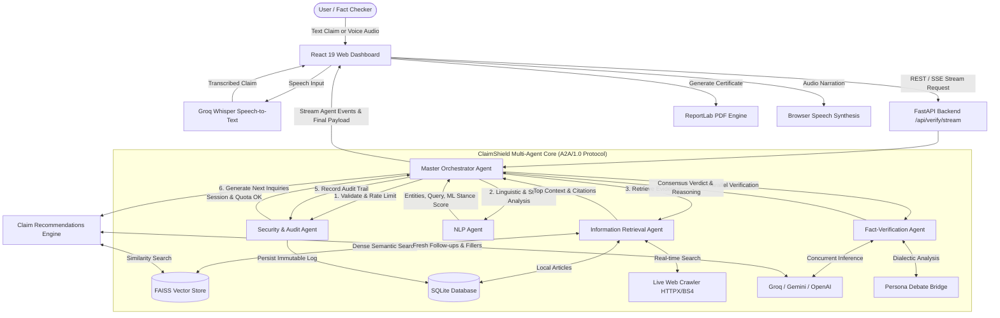

# 🛡️ ClaimShield AI — Multi-Agent Fact Verification System

[](https://www.python.org/)
[](https://fastapi.tiangolo.com/)
[](https://react.dev/)
[](https://github.com/langchain-ai/langgraph)
[](#-specialized-agents)
[](https://github.com/facebookresearch/faiss)
[](https://groq.com/)
[](LICENSE)

> **ClaimShield AI** is a state-of-the-art, production-grade **Agentic AI** framework designed for real-time news claim verification and misinformation defense. Built for the **Information Retrieval and Web Analytics (IT3041)** module, ClaimShield deploys a collaborative network of **5 specialized agents** interacting over the **A2A/1.0 (Agent-to-Agent) JSON messaging protocol**. The system combines dense vector retrieval, natural language processing, parallel multi-LLM consensus verification, persona debate reasoning, voice transcription, and contextual claim recommendations.

---

## 📑 Table of Contents
- [Key Features](#-key-features)
- [System Architecture](#️-system-architecture)
- [Specialized Agents](#-specialized-agents)
- [Workflow Pipeline](#-workflow-pipeline)
- [Tech Stack](#-tech-stack)
- [Project Directory Structure](#-project-directory-structure)
- [Quick Start Guide](#-quick-start-guide)
  - [Prerequisites](#prerequisites)
  - [One-Command Quickstart](#one-command-quickstart-recommended)
  - [Manual Setup](#manual-setup-step-by-step)
  - [Environment Configuration](#environment-configuration)
  - [Database Seeding](#database-seeding)
- [API Reference](#-api-reference)
- [A2A/1.0 Messaging Protocol](#-a2a10-messaging-protocol)
- [Evaluation & Testing](#-evaluation--testing)
- [Team Members & Contributions](#-team-members--contributions)
- [License](#-license)

---

## ✨ Key Features

- **🤖 5-Agent Collaborative Network**: Dedicated agents for Orchestration, NLP Analysis, Dense Retrieval, Multi-LLM Fact Verification, and Security & Audit.
- **⚡ Parallel Multi-LLM Consensus**: Concurrently queries **Groq (Llama 3.3 / GPT-OSS)**, **Google Gemini Flash**, and **OpenAI**, aggregating predictions into a weighted consensus with a mathematically derived agreement score.
- **🗣️ Multi-Agent Persona Debate**: An automated dialectic debate bridge (**FactChecker → Critic → Consensus**) cross-examines evidence and critiques intermediate findings before rendering a final judgment.
- **🎙️ Voice-to-Text Claim Input**: Direct audio recording and transcription powered by **Groq Whisper AI** (`whisper-large-v3-turbo` with fallback to `whisper-large-v3`), supporting formats up to 25 MB.
- **🔊 Audio Verdict Narration**: In-browser speech synthesis playback of the final verdict, confidence breakdown, and synthesized reasoning.
- **💡 Contextual Claim Recommendations**: A dual-layer recommendation engine generating fresh, high-value follow-up claims via LLMs and filling candidate gaps using FAISS semantic similarity (independent of user history to prevent echo chambers).
- **📡 Real-Time SSE Pipeline Streaming**: Server-Sent Events (`/api/verify/stream`) provide live stage-by-stage visual progress in the dashboard as each agent executes.
- **🔍 Hybrid Evidence Retrieval**: Dense vector search via **FAISS** (`all-MiniLM-L6-v2` embeddings) combined with SQLite local article archives and real-time live web scraping via **HTTPX** & **BeautifulSoup4**.
- **🔒 Enterprise Security & Governance**: PBKDF2-SHA256 password hashing, JWT session authentication, sliding token-bucket rate limiting, HTML sanitization, and immutable SQLite audit logging.
- **💳 Commercialization & Tier Management**: Tier-based resource gating (**Free vs. Pro vs. Enterprise**) with simulated checkout payment gateway supporting card validation (Luhn algorithm).
- **📄 Cryptographic Verification PDF Export**: Automated generation of publication-quality PDF verification certificates with source citations and cryptographic timestamps using ReportLab.
- **🌐 Interactive A2A Protocol Monitor & Responsible AI Hub**: Built-in inspector for auditing agent message payloads in real time, accompanied by ethics, fairness, and safety disclosures.

---

##  System Architecture


```mermaid
flowchart TD
    User([User / Fact Checker]) -->|Text Claim or Voice Audio| UI[React 19 Web Dashboard]
    UI -->|Speech Input| Whisper[Groq Whisper Speech-to-Text]
    Whisper -->|Transcribed Claim| UI
    
    UI -->|REST / SSE Stream Request| API[FastAPI Backend /api/verify/stream]
    API --> Orchestrator[Master Orchestrator Agent]

    subgraph "ClaimShield Multi-Agent Core (A2A/1.0 Protocol)"
        Orchestrator -->|1. Validate & Rate Limit| SecAgent[Security & Audit Agent]
        SecAgent -->|Session & Quota OK| Orchestrator
        
        Orchestrator -->|2. Linguistic & Stance Analysis| NLPAgent[NLP Agent]
        NLPAgent -->|Entities, Query, ML Stance Score| Orchestrator
        
        Orchestrator -->|3. Retrieve Evidence| RetAgent[Information Retrieval Agent]
        RetAgent <-->|Dense Semantic Search| FAISS[(FAISS Vector Store)]
        RetAgent <-->|Local Articles| SQLite[(SQLite Database)]
        RetAgent <-->|Real-time Search| WebScraper[Live Web Crawler HTTPX/BS4]
        RetAgent -->|Top Context & Citations| Orchestrator
        
        Orchestrator -->|4. Parallel Verification| VerAgent[Fact-Verification Agent]
        VerAgent <-->|Concurrent Inference| LLMs[Groq / Gemini / OpenAI]
        VerAgent <-->|Dialectic Analysis| Debate[Persona Debate Bridge]
        VerAgent -->|Consensus Verdict & Reasoning| Orchestrator
        
        Orchestrator -->|5. Record Audit Trail| SecAgent
        SecAgent -->|Persist Immutable Log| SQLite
    end

    Orchestrator -->|6. Generate Next Inquiries| RecEngine[Claim Recommendations Engine]
    RecEngine <-->|Fresh Follow-ups & Fillers| LLMs
    RecEngine <-->|Similarity Search| FAISS

    Orchestrator -->|Stream Agent Events & Final Payload| UI
    UI -->|Generate Certificate| PDFGen[ReportLab PDF Engine]
    UI -->|Audio Narration| SpeechSynth[Browser Speech Synthesis]
```

---

## 🤖 Specialized Agents

| # | Agent | Primary Role & Responsibilities | Key Technologies |
|---|---|---|---|
| **1** | **Master Orchestrator Agent** | Coordinates the entire agent lifecycle, manages state transitions via **LangGraph StateGraph**, enforces execution order, dispatches A2A/1.0 messages, and drives the **Multi-Agent Persona Debate** (FactChecker → Critic → Consensus). | `langgraph`, `asyncio`, Python 3.10+ |
| **2** | **NLP Agent** | Analyzes claim syntax, performs Named Entity Recognition (NER for persons, organizations, locations), extracts keywords for search query generation, and scores credibility stance using machine learning. | `spaCy (en_core_web_sm)`, `scikit-learn` (`TfidfVectorizer`, `LogisticRegression`) |
| **3** | **Information Retrieval (IR) Agent** | Indexes and retrieves ground-truth evidence across local and online corpora. Performs dense semantic vector matching and queries the live web for breaking news claims. | `FAISS (IndexFlatIP)`, `sentence-transformers (all-MiniLM-L6-v2)`, `httpx`, `BeautifulSoup4` |
| **4** | **Fact-Verification Agent** | Concurrently polls configured LLM backends (Groq, Gemini, OpenAI) with bounded latency, normalizes individual outputs, and synthesizes a weighted **cross-model consensus** with agreement scoring. Features an automated local heuristic engine when offline. | `Groq Cloud`, `Google Gemini API`, `OpenAI API`, Heuristic Fallback Engine |
| **5** | **Security & Audit Agent** | Enforces zero-trust input sanitization, PBKDF2 password hashing with unique salts, JWT token authentication, Token Bucket rate limiting per user tier, and tamper-evident audit logging. | `PyJWT`, `cryptography`, `hashlib`, `SQLite3` |

---

## 🔄 Workflow Pipeline

The claim verification pipeline executes through six coordinated stages:

1. **Authentication, Sanitization & Quota Check**:  
   User input is sanitized against malicious payloads and XSS. The Security Agent validates JWT claims and decrements the Token Bucket rate limit (Free tier: 3 verifications/hour; Pro/Enterprise: higher quotas).
2. **Linguistic Processing & Stance Prediction**:  
   The NLP Agent parses the claim with spaCy to extract entities (`PERSON`, `ORG`, `GPE`, `DATE`), extracts key noun-chunks for query reformulation, and applies a trained scikit-learn TF-IDF model to estimate baseline credibility.
3. **Multi-Source Evidence Retrieval**:  
   The IR Agent encodes the claim using `all-MiniLM-L6-v2` embeddings, searches the FAISS index for high-cosine similarity passages, checks the SQLite ground-truth news database, and triggers live web scraping if local confidence is insufficient.
4. **Parallel Multi-LLM Consensus & Persona Debate**:  
   All active LLM providers (Groq Llama 3.3, Google Gemini, OpenAI) are queried concurrently. Individual model verdicts (`TRUE`, `FALSE`, `PARTLY_TRUE`, `UNVERIFIED`) are aggregated into a weighted consensus score. The Multi-Agent Persona Debate bridge then runs a dialectic review (**FactChecker** proposal, **Critic** cross-examination, and **Consensus** determination).
5. **Contextual Claim Recommendation**:  
   The recommendation engine analyzes the verified claim and synthesizes 3–4 relevant follow-up claims (counter-arguments, statistical queries, broader implications) using parallel LLM calls, supplemented with FAISS semantic similarity matching.
6. **Audit Trail & Client Streaming**:  
   The Security Agent persists the immutable verification record in SQLite. The final payload, along with real-time SSE step events, is rendered on the React dashboard, ready for PDF export or audio verdict narration.

---

## 💻 Tech Stack

### Backend & AI Core
- **Runtime:** Python 3.10+
- **Framework:** FastAPI, Uvicorn, Starlette SSE
- **Agent Orchestration:** LangGraph (StateGraph), Custom A2A/1.0 Protocol Engine
- **NLP & Stance:** spaCy (`en_core_web_sm`), scikit-learn (TF-IDF Vectorizer + Logistic Regression)
- **Embeddings & Vector Search:** FAISS (`IndexFlatIP`), `sentence-transformers` (`all-MiniLM-L6-v2`)
- **Speech Recognition:** Groq Whisper Cloud API (`whisper-large-v3-turbo`)
- **LLM Integrations:** Groq SDK (Llama 3.3 70B, GPT-OSS), Google Gemini Flash API, OpenAI API
- **Web Crawling:** HTTPX (async client), BeautifulSoup4
- **Security:** PyJWT, PBKDF2 SHA-256 (`hashlib`), Cryptography
- **Database:** SQLite3, SQLAlchemy ORM, optional Supabase integration
- **Reporting:** ReportLab PDF Engine

### Frontend
- **Framework:** React 19, Vite 6
- **Styling:** Vanilla CSS design system tokens + Tailwind CSS v4, Lucide Icons
- **UI Components:** shadcn/ui accessible component primitives
- **Routing & State:** React Router 7, Context API (`AuthContext`, `RunContext`)
- **Audio:** Web Audio API & HTML5 MediaRecorder for voice input, Web Speech API for verdict narration
- **Themes:** Dark / Light mode system with animated ambient background

---

## 📁 Project Directory Structure

```text
ClaimShield_AI/
├── app/
│   ├── __init__.py               # Application package definition
│   ├── api.py                    # FastAPI server: REST endpoints & SSE streaming
│   ├── config.py                 # Central configuration, paths & environment variables
│   ├── generate_pdf.py           # ReportLab PDF verification certificate generator
│   ├── payment_gateway.py        # Commercial checkout simulator & Luhn card validator
│   ├── recommendations.py        # Contextual claim recommendation engine (LLM + FAISS)
│   ├── agents/
│   │   ├── __init__.py           # Multi-agent package marker
│   │   ├── base_agent.py         # Abstract base class & A2A/1.0 protocol specification
│   │   ├── orchestrator.py       # Master controller agent & pipeline manager
│   │   ├── nlp_agent.py          # NER & stance classification agent
│   │   ├── retrieval_agent.py    # FAISS semantic indexer & live web crawler
│   │   ├── verification_agent.py # Parallel multi-LLM consensus & offline heuristic engine
│   │   ├── security_agent.py     # JWT auth, token-bucket rate limiter & audit logger
│   │   ├── langgraph_workflow.py # LangGraph StateGraph pipeline definition
│   │   └── autogen_bridge.py     # Multi-agent persona debate bridge (FactChecker/Critic)
│   ├── database/
│   │   ├── __init__.py           # Database package
│   │   └── db_manager.py         # SQLite CRUD operations & Supabase connectors
│   └── utils/
│       ├── __init__.py           # Utilities package
│       ├── security.py           # Password hashing & JWT helpers
│       ├── vector_store.py       # FAISS vector store management
│       └── web_crawler.py        # Async HTTPX + BeautifulSoup4 web scraper
├── data/                         # Local database storage & FAISS vector index files
├── frontend/
│   ├── index.html                # Single Page Application entrypoint
│   ├── vite.config.js            # Vite configuration with /api proxy & aliases
│   └── src/
│       ├── App.jsx               # Application root, routing & providers
│       ├── main.jsx              # DOM entrypoint
│       ├── index.css             # Design tokens, themes & styles
│       ├── components/           # UI components
│       │   ├── AudioVerdictPlayer.jsx   # Text-to-speech verdict player
│       │   ├── AuthDialog.jsx           # Login & registration modal dialog
│       │   ├── ConsensusCard.jsx        # Multi-LLM consensus breakdown card
│       │   ├── DebateCard.jsx           # Multi-agent persona debate transcript
│       │   ├── EvidenceList.jsx         # Retrieved ground-truth evidence panel
│       │   ├── Navbar.jsx               # Navigation bar & authentication status
│       │   ├── PaymentDialog.jsx        # Subscription upgrade & checkout dialog
│       │   ├── PipelineLoader.jsx       # Real-time SSE agent execution indicator
│       │   ├── PlanCards.jsx            # Free / Pro / Enterprise tier comparison
│       │   ├── Recommendations.jsx      # Follow-up recommended claims panel
│       │   ├── VerdictCard.jsx          # Final verdict display & confidence gauge
│       │   └── VoiceClaimInput.jsx      # Voice recording & Whisper STT component
│       ├── context/              # Global React Context providers (Auth, Run)
│       ├── layouts/              # AppLayout, PublicLayout
│       ├── pages/                # Application pages
│       │   ├── A2AMonitorPage.jsx       # Real-time A2A protocol bus inspector
│       │   ├── AccountPage.jsx          # User profile, API keys & admin panel
│       │   ├── AuditPage.jsx            # Immutable audit trail & governance log
│       │   ├── DashboardPage.jsx        # Core claim verification dashboard
│       │   ├── LandingPage.jsx          # Hero presentation & feature tour
│       │   ├── PlansPage.jsx            # Subscription pricing & feature tiers
│       │   └── ResponsibleAIPage.jsx    # Ethics, fairness & transparency disclosures
│       └── services/api.js       # Unified HTTP and SSE backend client
├── tests/                        # Comprehensive test suite
│   ├── test_agents.py            # Individual unit tests for all 5 agents
│   ├── test_api.py               # FastAPI integration tests (auth, profile, SSE)
│   ├── test_langgraph_parity.py  # LangGraph vs standard orchestrator parity tests
│   ├── test_payment_gateway.py   # Checkout simulation & card validation tests
│   ├── test_recommendations.py   # Recommendation engine scoring & fallback tests
│   ├── test_verification.py      # Multi-LLM consensus, debate bridge & PDF tests
│   └── test_voice_transcribe.py  # Groq Whisper audio transcription tests
├── run.bat                       # One-click Windows runner
├── start.js                      # Universal cross-platform automated bootstrapper
├── run-py.js                     # Cross-platform Python virtualenv runner script
├── seed_database.py              # Knowledge base & FAISS index seeding script
├── requirements.txt              # Python dependencies
├── package.json                  # Root npm workspace & build scripts
└── README.md                     # Project documentation
```

---

## 🚀 Quick Start Guide

### Prerequisites
- **Python 3.10+**
- **Node.js 20.19+** (or 22.12+) & **npm**
- **Git**

---

### One-Command Quickstart (Recommended)

ClaimShield includes an intelligent bootstrapper (`start.js`) that automatically detects or creates the Python virtual environment (`.venv`), installs `requirements.txt`, downloads the spaCy English language model, installs frontend npm packages, and concurrently launches both the backend and frontend.

#### Windows:
Double-click `run.bat` or run in PowerShell / Command Prompt:
```cmd
run.bat
```
*(or via npm)*
```bash
npm start
```

#### macOS / Linux:
```bash
npm start
```

Once launched:
- **Frontend Dashboard:** [http://localhost:5173](http://localhost:5173)
- **FastAPI API & Docs:** [http://localhost:8000/docs](http://localhost:8000/docs)

---

### Manual Setup (Step-by-Step)

If you prefer to configure the environment manually:

1. **Clone the repository:**
   ```bash
   git clone https://github.com/RavinduPathirana28/ClaimShield_AI.git
   cd ClaimShield_AI
   ```

2. **Set up Python Virtual Environment:**
   ```bash
   # Windows (PowerShell)
   python -m venv .venv
   .\.venv\Scripts\Activate.ps1

   # macOS / Linux
   python3 -m venv .venv
   source .venv/bin/activate
   ```

3. **Install Dependencies & spaCy Model:**
   ```bash
   pip install --upgrade pip
   pip install -r requirements.txt
   python -m spacy download en_core_web_sm
   ```

4. **Install Frontend Dependencies:**
   ```bash
   npm install
   ```

5. **Run Development Servers:**
   - **Terminal 1 (Backend):**
     ```bash
     node run-py.js -m uvicorn app.api:app --port 8000 --reload
     ```
   - **Terminal 2 (Frontend):**
     ```bash
     npm run dev --workspace frontend
     ```

---

### Environment Configuration

ClaimShield AI runs out-of-the-box in **offline/local mode** using SQLite, FAISS, and a deterministic local heuristic fallback engine.

To unlock live multi-LLM consensus and voice transcription, create a `.env` file in the root directory:

```env
# ==============================================================================
# LLM Providers (Provide at least one for live cloud consensus)
# ==============================================================================
GROQ_API_KEY="gsk_your_groq_api_key_here"
GEMINI_API_KEY="AIzaSy_your_gemini_api_key_here"
OPENAI_API_KEY="sk_your_openai_api_key_here"

# ==============================================================================
# Security & JWT Configuration
# ==============================================================================
JWT_SECRET="claimshield_super_secure_secret_token_key_2026"
JWT_EXPIRY_MINUTES=60

# ==============================================================================
# Cloud Database (Optional - defaults to local SQLite if omitted)
# ==============================================================================
SUPABASE_URL=""
SUPABASE_KEY=""
```

> **Note on Voice Transcription:** Speech-to-text uses the `GROQ_API_KEY` to access the ultra-fast Groq Whisper endpoint (`whisper-large-v3-turbo`).

---

### Database Seeding

The application automatically seeds the SQLite database and builds the FAISS vector index on its first startup. To trigger a manual re-seed:

```bash
node run-py.js seed_database.py
```

---

## 📡 API Reference

The FastAPI backend exposes comprehensive REST endpoints and real-time streaming:

| Method | Endpoint | Description | Auth Required |
|---|---|---|---|
| `POST` | `/api/auth/register` | Register a new user account with hashed password | No |
| `POST` | `/api/auth/login` | Authenticate credentials and return JWT bearer token | No |
| `GET` | `/api/user/profile` | Retrieve authenticated user profile and subscription status | Yes (Bearer) |
| `POST` | `/api/user/plan` | Update user subscription plan tier (Free / Pro / Enterprise) | Yes (Bearer) |
| `POST` | `/api/user/password` | Change account password with current password verification | Yes (Bearer) |
| `GET` | `/api/admin/users` | List all registered users (Admin access only) | Yes (Admin) |
| `POST` | `/api/payment/checkout` | Process simulated subscription checkout with card validation | Yes (Bearer) |
| `POST` | `/api/verify` | Execute non-streaming claim verification | Optional |
| `POST` | `/api/verify/stream` | **Primary:** Real-time Server-Sent Events (SSE) verification stream | Optional |
| `POST` | `/api/transcribe` | Convert recorded speech audio into text via Groq Whisper AI | Optional |
| `POST` | `/api/export-pdf` | Generate and download ReportLab PDF verification certificate | Optional |
| `GET` | `/api/audit-logs` | Retrieve chronological audit trail records | Optional |
| `GET` | `/api/health` | Service health status and provider connectivity check | No |

---

## 📨 A2A/1.0 Messaging Protocol

All agents in ClaimShield communicate via standardized, deterministic JSON envelopes adhering to the **A2A/1.0 (Agent-to-Agent)** specification:

```json
{
  "protocol": "A2A/1.0",
  "message_id": "8f3b2c14-5d82-4f9e-a89c-31d25b421a99",
  "sender": "orchestrator",
  "recipient": "nlp_agent",
  "action": "process_claim",
  "timestamp": 1726998000.12,
  "data": {
    "claim": "Official health reports confirm regular exercise reduces cardiovascular disease risk."
  }
}
```

The live interaction stream can be inspected directly inside the application via the **A2A Protocol Monitor** page (`/a2a-monitor`).

---

## 🧪 Evaluation & Testing

ClaimShield maintains a comprehensive automated test suite across seven testing modules:

```bash
# Run the complete test suite
node run-py.js -m unittest discover -s tests -v

# Or via npm script
npm test
```

### Targeted Test Suites

```bash
# 1. Multi-Agent Unit Tests (Security, NLP, Retrieval, Verification, Orchestrator)
node run-py.js -m unittest tests/test_agents.py -v

# 2. FastAPI Endpoints, Authentication, Profile, and SSE Tests
node run-py.js -m unittest tests/test_api.py -v

# 3. Multi-LLM Consensus, Agreement Scoring, Debate Bridge & PDF Tests
node run-py.js -m unittest tests/test_verification.py -v

# 4. Contextual Claim Recommendation Engine & Fallback Tests
node run-py.js -m unittest tests/test_recommendations.py -v

# 5. Payment Gateway Simulation & Luhn Algorithm Tests
node run-py.js -m unittest tests/test_payment_gateway.py -v

# 6. LangGraph StateGraph Execution Parity Tests
node run-py.js -m unittest tests/test_langgraph_parity.py -v

# 7. Groq Whisper Voice Audio Transcription Tests
node run-py.js -m unittest tests/test_voice_transcribe.py -v
```

---

## 👥 Team Members & Contributions

**Module:** Information Retrieval and Web Analytics (IT3041)  
**Project:** ClaimShield AI — Multi-Agent Fact Verification System  

| Member | Assigned Agent & Specialization | Primary Responsibilities |
|---|---|---|
| **Member 1 (Lead)** | **NLP Agent** & Security Evaluation (Specialization 1) | spaCy entity extraction, TF-IDF stance classification, prompt injection & jailbreak vulnerability assessment, architecture lead |
| **Member 2** | **Information Retrieval (IR) Agent** | Dense vector search (FAISS), `all-MiniLM-L6-v2` indexing, live web crawler, database seeding & corpus ingestion |
| **Member 3** | **Fact-Verification Agent** | Multi-LLM parallel consensus (Groq, Gemini, OpenAI), persona debate bridge, agreement metric formulation, ReportLab PDF generator |
| **Member 4** | **Security & Audit Agent** | PBKDF2 hashing, JWT authentication, sliding token-bucket rate limiting, checkout gateway simulation, immutable audit logging |

---

## 📄 License
This project is licensed under the [MIT License](LICENSE).
